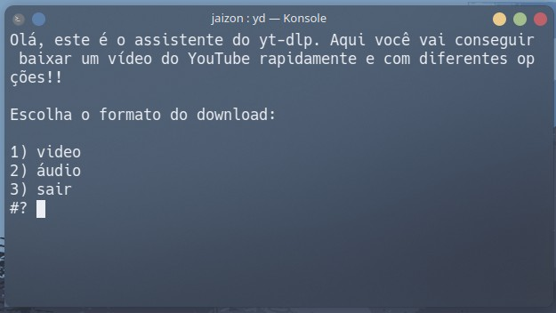
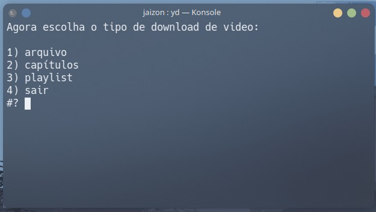
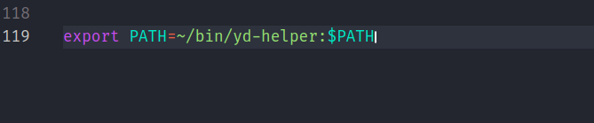

# yd-helper

Um utilitário para automatizar o download de vídeos do YouTube usando yt-dpl.

No momento, ele dá a opção de fazer o download de um vídeo em formato de vídeo ou áudio.

Depois, você pode escolher se vai baixar o arquivo inteiro, capítulos (quando o vídoe tiver marcações) e playlists.

No caso de capítulos, o programa salva cada um com o respectíco título, em uma pasta com o título correspondente ao do vídeo.

Algo parecido acontece com as playlists, onde todos os vídeos são salvos com seu título original dentro de uma pasta com o mesmo título que a playlist.

## Importante

## Instalação

Para instalar, basta executar o comando abaixo no terminal:

```
git clone https://github.com/devjaizon/yd-helper.git ~/bin/yd-helper && chmod +x ~/bin/yd-helper/yd && export PATH=~/bin/yd-helper:$PATH
```

Ele faz o download dos arquivos acima na pasta correta, dá permissões de execução para o script e adiciona o programa ao $PATH para você poder executar via terminal.

Mas ele só vai ficar disponível no terminal durante a seção. Para fazer ele funcionar permanetenemete, você deve adicionar o seguinte código ao final do arquivo ".bashrc" ou ".zshrc", na sau pasta Home:

```
export PATH=~/bin/yd-helper:$PATH
```

Você pode fazer isso com o seu editor de texto favorito. Por exemplo:

```
code ~/.zshrc
```


Agora é só salvar o arquivo e reiniciar o terminal, ou rodar o comando:

```
 source ~/.zshrc
```

"source ~/.bashrc", no caso de bash!
